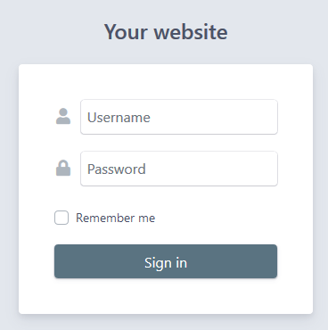

## Authentication

`EasyAdminPlus` is packaged with an `Authentication` layer which allows you to restrict access to the admin area.

### Configuration
Update ```config/packages/security.yaml``` configuration: 

```yaml
security:
    encoders:
        # ...
        Wandi\EasyAdminPlusBundle\Entity\User: bcrypt
    
    providers:
        # ...    
        wandi_easy_admin_plus:
            entity: { class: 'Wandi\EasyAdminPlusBundle\Entity\User' }
            
    firewalls:
        wandi_easy_admin_plus:
            pattern: ^/admin
            anonymous: ~
            logout:
                path: wandi_easy_admin_plus_logout
                target: easyadmin
            form_login:
                login_path: wandi_easy_admin_plus_login
                check_path: wandi_easy_admin_plus_login
                default_target_path: easyadmin
                remember_me: true
                csrf_token_generator: security.csrf.token_manager
        # ...

    access_control:
        - { path: '^/admin/login', role: IS_AUTHENTICATED_ANONYMOUSLY }
        - { path: '^/admin/', role: ROLE_EASY_ADMIN }
        # ...
```

:exclamation: Make sure that no conflicting firewall is declared before ours (a firewall that will match with the prefix we use)

### Update schema

The bundle uses its own **User** entity. So we need to update your database schema.
```
$ php bin/console doctrine:schema:update -f
```

### Commands

* Create an admin
 ```
 php bin/console wandi:easy-admin-plus:user:create admin password
 ```

* Change admin password
 ```
 php bin/console wandi:easy-admin-plus:user:change-password admin password2
 ```

* Enable an admin
 ```
 php bin/console wandi:easy-admin-plus:user:enable admin
 ```
 
* Disable an admin
 ```
 php bin/console wandi:easy-admin-plus:user:disable admin
 ```
 
 ### Login Screen
 
 The login `form` get the `site_name` property from `EasyAdmin` configuration.
 
  
 
 ### Fixtures
 
 :exclamation: If you're using `DataFixtures` in your project, to avoid admin's lost, we recommand you to add a `LoadAdmin` Fixtures that uses the previous command.

```php
<?php

namespace App\DataFixtures\ORM;

use Doctrine\Common\DataFixtures\AbstractFixture;
use Doctrine\Common\DataFixtures\OrderedFixtureInterface;
use Doctrine\Common\Persistence\ObjectManager;
use Symfony\Component\DependencyInjection\ContainerAwareInterface;
use Symfony\Component\DependencyInjection\ContainerInterface;
use Symfony\Bundle\FrameworkBundle\Console\Application;
use Symfony\Component\Console\Input\ArrayInput;
use Symfony\Component\Console\Output\NullOutput;

class LoadAdmin extends AbstractFixture implements OrderedFixtureInterface, ContainerAwareInterface
{
    /**
     * @var ContainerInterface
     */
    private $container;

    public function load(ObjectManager $em)
    {
        $time = time();

        $application = new Application($this->container->get('kernel'));
        $application->setAutoExit(false);

        $input = new ArrayInput(array(
            'command' => 'wandi:easy-admin-plus:create-user',
            'username' => 'YOUR_LOGIN',
            'password' => 'YOUR_PASSWORD',
        ));
        $output = new NullOutput();

        $application->run($input, $output);

        echo '  '.(time() - $time)." seconds\n";
    }

    /**
     * Sets the container.
     *
     * @param ContainerInterface|null $container A ContainerInterface instance or null
     */
    public function setContainer(ContainerInterface $container = null)
    {
        $this->container = $container;
    }

    /**
     * Get the order of this fixture.
     *
     * @return int
     */
    public function getOrder()
    {
        return 0;
    }
}

```

Back to [ReadMe](../README.md) | Next Chapter > [Generator](doc/chapter-2.md)