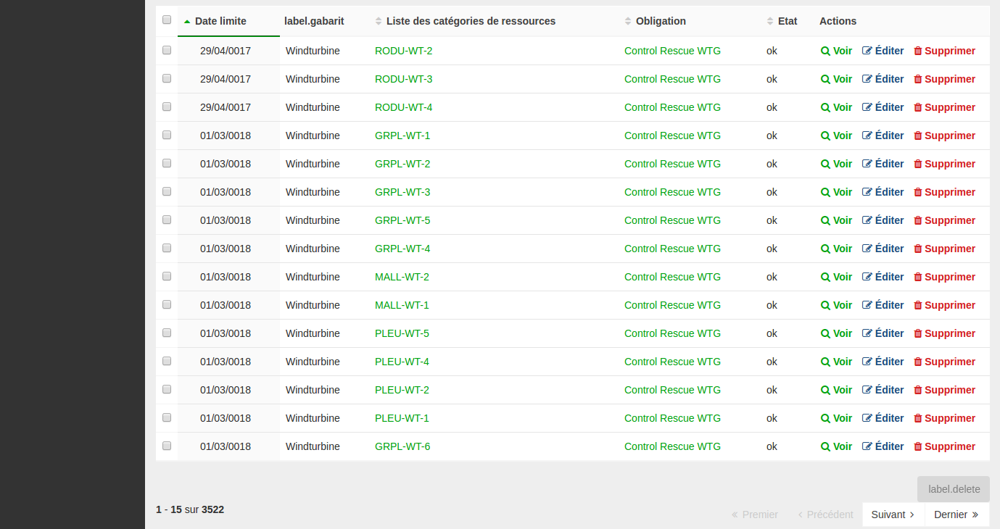

# Batch actions

Batch actions are actions triggered on a set of selected objects.

### Settings

To enable batch actions, you've to add a new node (`batchs`) for the action `list` of the entity.

```yaml
# config/packages/easy_admin.yaml
easy_admin:
    entities:
        Controle:
            class: App\Entity\Controle
            disabled_actions: ['new']
            role: ROLE_CONTROLE
            list:
                title: title.echeance.list
                batchs:
                    - { name: delete, icon: trash, label: label.delete, service: lle.service.delete_batch }
                    - { name: clos, icon: check, label: label.valider, service: App\Service\Batch\ControleCloreBatch, role: 'ROLE_ADMIN' }
                actions:
                    - { name: show, icon: search }
                    - { name: edit, icon: edit }
                    - { name: delete, icon: trash }
```
On the list, checkbox inputs are added toselect items and buttons are visible on bottom of the list.

<p align="center">
    
</p>


Exemple BatchAction

```php
<?php
class DeleteBatch implements BatchInterface
{
    private $count = 0;

    public function execute($request, array $entityConfig, $ids, array $data) 
    {
        foreach ($ids as $itemId) {
            $count++;
        }
    }
    
    public function countSuccess(){
        return $this->count;
    }


}
```

-------

### Default behavior

Button are enable only if items are selected

----------

### Role

By default, batch action will be only accessible to users with role defined like this ROLE_[ENTITY_NAME]_BATCH_[BATCH_NAME]
You can disable this with the param 
```
role: null
```
or define your role permission
```
role: ROLE_ADMIN
```

----------

[Back to main readme](../README.md)
