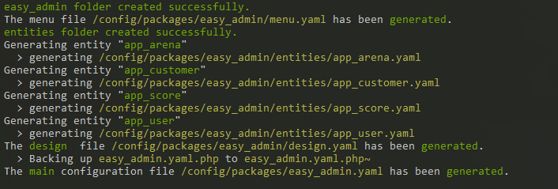
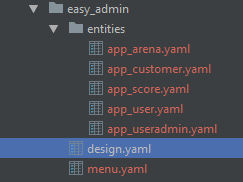
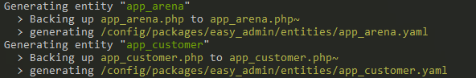
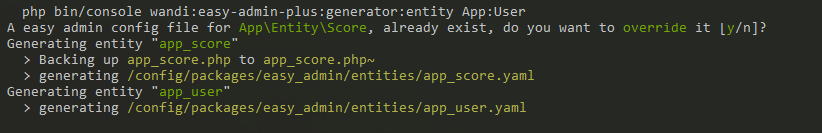

# Generator

`EasyAdminPlus` is packaged with a generator which create the default [EasyAdmin](https://symfony.com/doc/current/bundles/EasyAdminBundle/book/configuration-reference.html) configuration file based on your `Entities` reflection.

## Intro

:exclamation: The purpose of this generator is not to write all the configuration for you but to get rid of the tedious writing time of the settings if you've many entities.

**Up to you to enrich these settings by yourself after the complete generation.**

 Generator tries to guess to correct type based on several reflection processes:
 * PHP typehinting
 * Doctrine types
 * Annotations
 * Asserts
 
 ## Configuration
 
 ```yaml
# config/packages/wandi_easyadmin_plus.yaml
wandi_easy_admin_plus:
    generator:
    # The level of indentation of the Yaml Dumper
    dump_indentation: 4
    # The level where you switch to inline YAML
    dump_inline: 6
    # the name of the Backend
    name_backend: Back Office
    # name of your custom translation domain
    translation_domain:
    # list of bundles whose entities will not be generated by the generator
    bundles_filter:
        - WandiEasyAdminPlusBundle
        - ...
    # list of available actions by methods
    methods:
        list:
            - new
            - show
            - edit
            - delete
            - ...
        show:
            - edit
            - delete
        edit: []
        new: []
    # list of icons assigned to each action
    icons:
        actions:
            - {new: add}
            - {show: search}
            - {edit: edit}
            - {delete: trash}
            - ...
    fields:
        methods:
            - new
            - show
        labels: ~
    # array
    sort:
        #list of methods where sorting is available
        methods:
            - list
        properties:
            - { name: 'position', order: 'ASC' }
            - { name: 'id', order: 'DESC' }
    # list og web assets to load in the backend pages
    assets:
        # JavaScript files
        js:
            - /bundles/cksourceckfinder/ckfinder/ckfinder.js
            - ...
        # CSS files
        css:
            - ...       
 ```
 
 All the settings are optional.
 
 ### Entities used for the example
 
 * Comment
 
 * Post
 
 * Tags
 
 ## Commands
 
 ### Generate configuration files
 
  ```shell
  php bin/console wandi:easy-admin-plus:generator:generate
  ```
  <p align="center">
      
  </p>
  
  At first launch, the command will create the easy_admin folder, in it will be generated:
  <ul>
      <li> the design.yaml file which contains the basic configuration of your backend </li>
      <li> the menu.yaml file which contains the menu configuration of your backend </li>
      <li> the entities folder with the configuration files of each entity </li>
  </ul>
  <p align="center">
       
  </p>
  Regarding the configuration file tree, we took the example of the official EasyAdmin demo (cf https://github.com/javiereguiluz/easy-admin-demo/tree/master/config/packages/easy_admin).
  If you retry the command, a backup of the configuration files of each previously created entity will be made.
  <p align="center">
        
    </p>
    
  * Generated Post entity configuration file
   ```yaml
  # config/packages/easy_admin/entities/app_post.yaml
  easy_admin:
      entities:
          app_post:
              class: App\Entity\Post
              disabled_actions: []
              list:
                  title: 'List post'
                  actions:
                      - { name: new, label: new, icon: add }
                      - { name: show, label: show, icon: search }
                      - { name: edit, label: edit, icon: edit }
                      - { name: delete, label: delete, icon: trash }
                  fields:
                      - { property: id, label: id }
                      - { property: title, label: title }
                      - { property: slug, label: slug }
                      - { property: summary, label: summary }
                      - { property: publishedAt, label: publishedAt }
                      - { property: author, label: author }
                      - { property: tags, label: tags }
                  sort:
                      - id
                      - DESC
              show:
                  title: 'Fiche post'
                  actions:
                      - { name: edit, label: edit, icon: edit }
                      - { name: delete, label: delete, icon: trash }
                  fields:
                      - { property: id, label: id }
                      - { property: title, label: title }
                      - { property: slug, label: slug }
                      - { property: summary, label: summary }
                      - { property: content, label: content, type: raw }
                      - { property: publishedAt, label: publishedAt }
                      - { property: author, label: author }
                      - { property: comments, label: comments }
                      - { property: tags, label: tags }
              edit:
                  title: 'Edit post'
                  actions: []
                  fields:
                      - { property: title, label: title }
                      - { property: slug, label: slug }
                      - { property: summary, label: summary }
                      - { property: content, label: content, help: 'The number of characters must be greater than 10.' }
                      - { property: publishedAt, label: publishedAt }
                      - { property: author, label: author, type: easyadmin_autocomplete }
                      - { property: comments, label: comments, type: easyadmin_autocomplete, type_options: { by_reference: false } }
                      - { property: tags, label: tags, type: easyadmin_autocomplete, help: 'The number of elements must be less than or equal to 4.' }
              new:
                  title: 'Add post'
                  actions: []
                  fields:
                      - { property: title, label: title }
                      - { property: slug, label: slug }
                      - { property: summary, label: summary }
                      - { property: content, label: content, help: 'The number of characters must be greater than 10.' }
                      - { property: publishedAt, label: publishedAt }
                      - { property: author, label: author, type: easyadmin_autocomplete }
                      - { property: comments, label: comments, type: easyadmin_autocomplete, type_options: { by_reference: false } }
                      - { property: tags, label: tags, type: easyadmin_autocomplete, help: 'The number of elements must be less than or equal to 4.' }
   ```
  
 ### Generate the configuration file for one or more specific entities
  ```shell
  php bin/console wandi:easy-admin-plus:generation:entity entity_1 entity_2 ...
  ```
  If the entities passed as parameters are linked to other entities, we will propose to regenerate their configuration file.
  <p align="center">
      
  </p>
  
  
### Type Guessing
* Doctrine match
  * 
* EA match
  * 


### Supported 3rd party vendors

* VichUploaderBundle
* StofDoctrineExtensionsBundle

----------

Next chapter: [Chapter 3 - Translation Action](chapter-3.md)