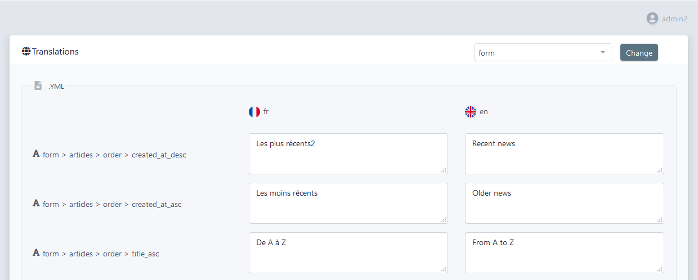
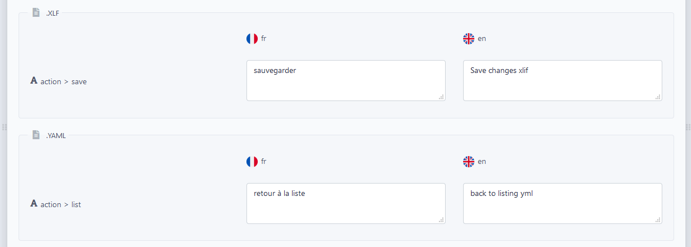
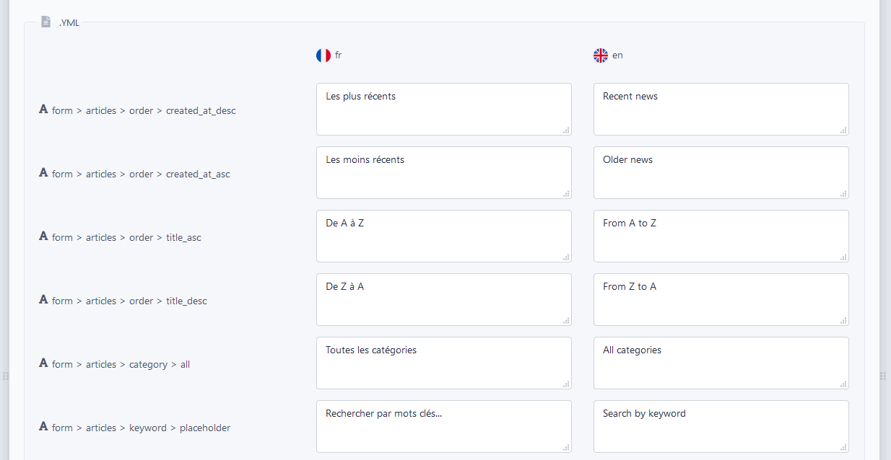
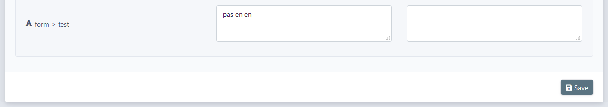
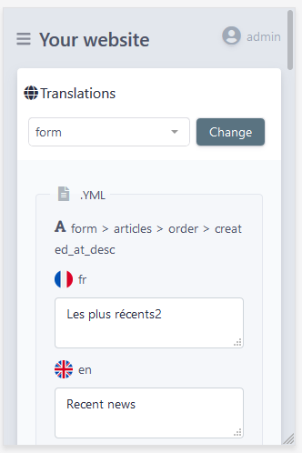

# Translator

`EasyAdminPlus` is packaged with an action to manage all your translations files directly in the admin area.

<p align="center">
    
</p>

-------

### Configuration

```yaml
# config/packages/wandi_easyadmin_plus.yaml
wandi_easy_admin_plus:
    translator:
        # defines the locales you want to manage
        locales:
            - fr
            - en
        # defines the directories in which you want to extract translations files
        paths:
            - /translations
            - ...
        # defines a list of domains you want to exclude from admin
        excluded_domains:
            - validators
            - ...
```

All the settings are optional.

If you don't provide them, the `Translator` will extract files located in the default `Symfony 4` translations directory (`/translations`) and only work with your default locale (`locale` parameter or `kernel.default_locale` if not set)

-------

### Loading

Add the `wandi_easy_admin_plus_translations` route in the `menu` attribute of the `EasyAdmin` configuration file.

```yaml
# config/packages/easy_admin.yaml
easy_admin:
    site_name: Your website
    design:
        # ...
        menu:
            # ...
            - { route: 'wandi_easy_admin_plus_translations', label: 'Translations', icon: 'globe' }
```

-------

### Translations Screen

Just browse `/admin/translations` or click on your item in the `EasyAdmin` menu.

#### 1. First part

You can switch the current domain to manage.

<p align="center">
    
</p>

-------

#### 2. Middle part

You've a list of:
* all matching files (if you're using several files formats for the same domain), note that we only display file extension.
* all the keys (`action.save` is exploded into `action > save` for user readability) 
* all the translations values in all the locales you defined.

*Eg: several files*
<p align="center">
    
</p>

-------

*Eg: classic case with only one file*
<p align="center">
    
</p>

*The grid uses a `display: flex` layout, so every translation value will be floated.*

-------

#### 3. Last part

You can submit and save your changes by clicking on the button located in the sticky bottom bar.

<p align="center">
    
</p>

-------

### Translations Screen - Mobile

The entire action is also responsive:

<p align="center">
    
</p>

-------

### Supported formats

The `Translator` manage all the [translations formats supported by Symfony](https://symfony.com/doc/current/components/translation.html#component-translator-message-catalogs) (yaml, xlf, json, ts, php, po, mo, ini, csv).
 
It preserves the original file format when committing the changes.

All the files are backuped according to the Symfony convention (eg: `messages.en.xlf~`) before the erasing task is complete.

-------

### Behind the scenes

The `Translator` list all the translations files in the directories paths provided, excludes unwanted domains if needed and extracts the distinct files and all the keys from the dictionaries.

*Notes:*
- If a file is missing in another locale, it'll be created after submission with empty values.
- If some keys are missing in the same file in another locale, they will be added with empty values after submission.

When submitting the form, files on the current domain are backuped and erased with your changes. 

Message is added  in `session flashbag` and translations' cache dir (`kernel.cache_dir`) is cleared for production use before forwarding on GET.

-------

### Events

The `Translator` component dispatchs two events.

##### PRE_TRANSLATE

The event is dispatched when an admin accesses the form on a specific domain.

```php
use Symfony\Component\EventDispatcher\GenericEvent;
use Wandi\EasyAdminPlusBundle\Translator\Event\EasyAdminPlusTranslatorEvents;

$this->get('event_dispatcher')->dispatch(EasyAdminPlusTranslatorEvents::PRE_TRANSLATE,
    new GenericEvent($domain, [
        'domain' => $domain,
        'user' => [
            'username' => $user ? $user->getUsername() : null,
            'roles' => $user ? $user->getRoles() : [],
        ],
    ])
);
```

##### POST_TRANSLATE

The event is dispatched when an admin submits the form on a specific domain.

```php
use Symfony\Component\EventDispatcher\GenericEvent;
use Wandi\EasyAdminPlusBundle\Translator\Event\EasyAdminPlusTranslatorEvents;

$this->get('event_dispatcher')->dispatch(EasyAdminPlusTranslatorEvents::POST_TRANSLATE,
    new GenericEvent($domain, [
        'domain' => $domain,
        'files' => $fileNames,
        'user' => [
            'username' => $user ? $user->getUsername() : null,
            'roles' => $user ? $user->getRoles() : [],
        ],
    ])
);
```

##### Subscribe events

```php
use Wandi\EasyAdminPlusBundle\Translator\Event\EasyAdminPlusTranslatorEvents;

class EasyAdminPlusSubscriber implements EventSubscriberInterface
{
    /**
     * @return array
     */
    public static function getSubscribedEvents()
    {
        // return the subscribed events, their methods and priorities
        return array(
            EasyAdminPlusTranslatorEvents::PRE_TRANSLATE => 'logAccess',
            EasyAdminPlusTranslatorEvents::POST_TRANSLATE => 'clearVarnishCache',
        );
    }
    
    /**
     * Log admin access
     *
     * @param GenericEvent $event event
     */
    public function logAccess(GenericEvent $event): bool
    {
        $domain = $event->getArguments()['domain'];
        $user = $event->getArguments()['user'];
        
        # your logic
    }
    
    /**
     * Clear Varnish Cache
     *
     * @param GenericEvent $event event
     */
    public function clearVarnishCache(GenericEvent $event): bool
    {
        $domain = $event->getArguments()['domain'];
        $files = $event->getArguments()['files'];
        $user = $event->getArguments()['user'];
        
        # your logic
    }
```

----------

Next chapter: [Chapter 4 - ACL](chapter-4.md)