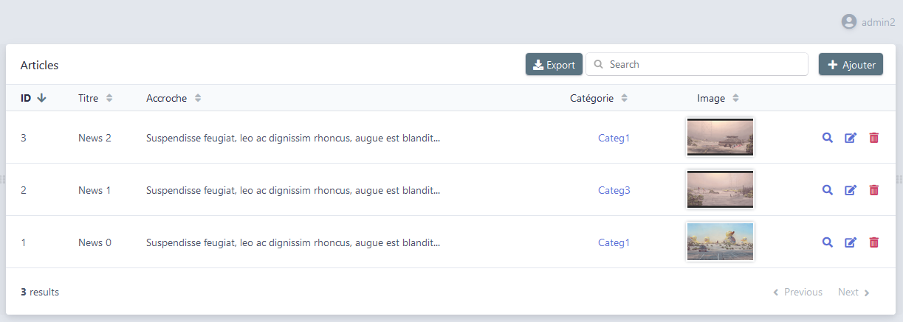
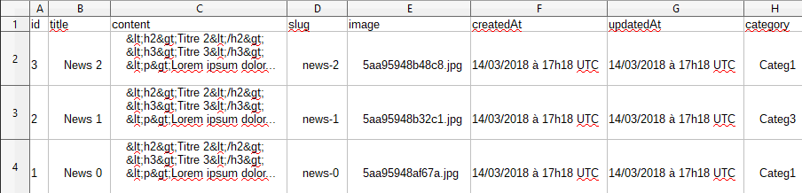
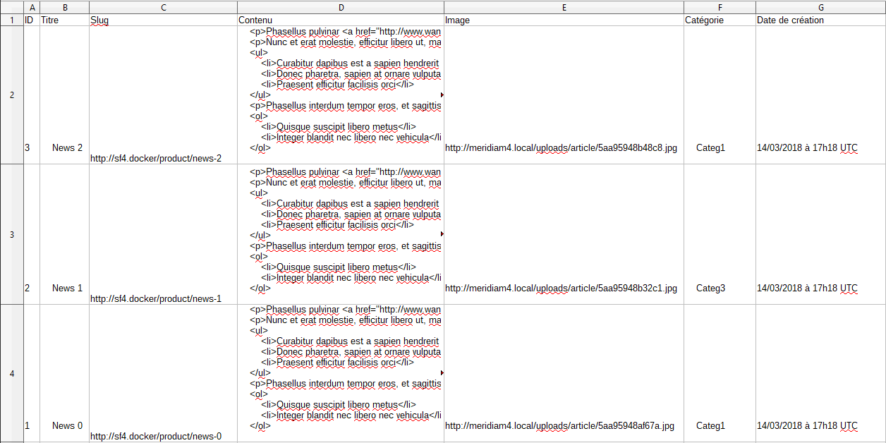

# Export Action

`EasyAdminPlus` is packaged with an action to export all your entities in CSV.

### Settings

The `export` action is disabled by default.

To enable it, you've to add a new action node (`export`) in `EasyAdmin` configuration like others ones (`list`, `show`, `new`, `edit`, `form`, `delete`, `search`).

You've to add this action on all Entities on which you want to enable `export` feature.

```yaml
# config/packages/easy_admin.yaml
easy_admin:
    entities:
        Product:
            class: App\Entity\Product
            list:
                # ...
            search:
                # ...
            new:
                # ...
            edit:
                # ...
            show:
                # ...
            delete:
                # ...
            export:
                # action is enabled for Product Entity!
```

A new button is visible on top of `List` action, beside `New` action.

<p align="center">
    
</p>

-------

### Exported recordsets

We recover the current `Paginator` (and the `query` from the `Search` if used) to build the recordsets to export.

-------

### Field formatting

We use the twig Extension to render each field based on `EasyAdmin` type guessing.

So, all your [format settings](https://symfony.com/doc/master/bundles/EasyAdminBundle/book/list-search-show-configuration.html#formatting-dates-and-numbers) like date, numbers, [...] will be applied to your CSV export.

It means that Doctrine allows us to render correctly all the native types like `string` (`varchar`, `text`), `numbers` (`*int`, `float`), `date` (`date`, `datetime`, `timestamp`, [...]) and `associations` (thanks to `__toString`).

To see the complete list, check all the files named `field_{*}.html.twig` in `EasyAdmin` [default views](https://github.com/EasyCorp/EasyAdminBundle/tree/master/src/Resources/views/default):
> vendor/easycorp/easyadmin-bundle/Resources/views/default

`WandiEasyAdminPlus` simply overrides the following fields to strip some extra infos and html tags for proper text plain formatting:
* field_association.html.twig (strip `html` and put `comas` between related entities if iterable)
* field_file.html.twig (strip `html` and put `absolute url` to file)
* field_image.html.twig (strip `html` and put `absolute url` to image)
* field_tel.html.twig (strip `html` and `tel:` prefix)
* field_url.html.twig (strip `html`)
* label_null.html.twig (strip `label`, simple empty string)

-------

### Default behavior

If you set any settings in `export` node, the action will export all `Entity` fields based on the default field formatting (see above).

It means that all custom fields (image, file, html content) will not be correctly rendered (displayed as a simple string).

It'll use exactly the same formatting as `List` action if you not set any fields in configuration.

<p align="center">
    
</p>

-------

### Proper formatting

Like any others `EasyAdmin` actions, you can define a `fields` node in configuration.

In this node, you can:
* put a human readable label for each field (legend for each column on the first line)
* choose fields order
* restrict fields you want to be present on the export 
* use [custom type](https://symfony.com/doc/master/bundles/EasyAdminBundle/book/list-search-show-configuration.html#property-types-defined-by-easyadmin) supported by `EasyAdmin`
* override a field with a [custom template](https://symfony.com/doc/master/bundles/EasyAdminBundle/book/list-search-show-configuration.html#rendering-entity-properties-with-custom-templates)

```yaml
# config/packages/easy_admin.yaml
easy_admin:
    entities:
        Product:
            class: App\Entity\Product
            list:
                # ...
            search:
                # ...
            new:
                # ...
            edit:
                # ...
            show:
                # ...
            delete:
                # ...
            export:
                fields:
                    - { property: 'id', label: 'ID' }
                    - { property: 'title', label: 'Titre' }
                    - { property: 'slug', label: 'Slug', template: 'easy_admin/product_slug.html.twig' }
                    - { property: 'content', label: 'Contenu', type: 'raw' }
                    - { property: 'image', label: 'Image', type: 'image', base_path: "%article_path%" }
                    - { property: 'category', label: 'Catégorie' }
                    - { property: 'createdAt', label: 'Date de création', type: 'datetime' }
```

We perform the same configuration passes than `EasyAdmin`, so you can write the `properties` the [way you want](https://symfony.com/doc/master/bundles/EasyAdminBundle/book/list-search-show-configuration.html#customize-the-properties-displayed).

In this example, we:
* choose a custom fields order
* restrict export to a few fields
* put french labels on all fields
* set custom `EasyAdmin `types (raw for HTML content, image for VichFile, but all types supported by `EasyAdmin` are possible)
* override the `slug` property with a custom template (to prepend the base url on the product slug)

```twig
{# templates/easy_admin/product_slug.html.twig #}
{{ 'http://sf4.docker/product/' ~ value }}
```

<p align="center">
    
</p>

-------

### ACL

Thanks to [ACL](chapter-4.md) feature, you can restrict `Export` action to a specific `role`.

Simply add the minimum role required to get the feature enabled:

```yaml
# config/packages/easy_admin.yaml
easy_admin:
    entities:
        Product:
            class: App\Entity\Product
            list:
                # ...
            search:
                # ...
            new:
                # ...
            edit:
                # ...
            show:
                # ...
            delete:
                # ...
            export:
                role: ROLE_EASY_ADMIN_SUPER
                fields:
                    # ...
```

```twig
{# vendor/wandi/easyadmin-plus-bundle/resources/views/default/list.html.twig #}

{# ... #} 


    {# Do not display EXPORT button if not defined or not granted #}
    
      
      <div class="button-action">
        <a class="btn btn-primary" href="{{ path('easyadmin', app.request.query|merge({ action: "export" })) }}">
          <i class="fa fa-download"></i>
            {{ 'exporter.export'|trans({}, 'EasyAdminPlusBundle') }}
        </a>
      </div>
  
  {# Do not display NEW button if not granted #}
  
    {{ parent() }}
  

```

-------

### Events

The `Exporter` component dispatchs two events.

Both events use the `EasyAdmin` dispatcher which automatically merge custom infos (`user`) with default params (`config`, `em`, `entity` and `request`).

##### PRE_EXPORT

The event is dispatched before the export.

```php
use Wandi\EasyAdminPlusBundle\Exporter\Event\EasyAdminPlusExporterEvents;

$this->dispatch(EasyAdminPlusExporterEvents::PRE_EXPORT, [
    'user' => [
        'username' => $user ? $user->getUsername() : null,
        'roles' => $user ? $user->getRoles() : [],
    ],
]);
```

##### POST_EXPORT

The event is dispatched after the export.

```php
use Wandi\EasyAdminPlusBundle\Exporter\Event\EasyAdminPlusExporterEvents;

$this->dispatch(EasyAdminPlusExporterEvents::PRE_EXPORT, [
    'user' => [
        'username' => $user ? $user->getUsername() : null,
        'roles' => $user ? $user->getRoles() : [],
    ],
]);
```

##### Subscribe events

```php
use Wandi\EasyAdminPlusBundle\Exporter\Event\EasyAdminPlusExporterEvents;

class EasyAdminPlusSubscriber implements EventSubscriberInterface
{
    /**
     * @return array
     */
    public static function getSubscribedEvents()
    {
        // return the subscribed events, their methods and priorities
        return array(
            EasyAdminPlusExporterEvents::PRE_EXPORT => 'checkUserRights',
            EasyAdminPlusExporterEvents::POST_EXPORT => 'logExport',
        );
    }
    
    /**
     * Throws an AccessDeniedException if user haven't enough privileges
     *
     * @param GenericEvent $event event
     * @return bool
     * @throws AccessDeniedException
     */
    public function checkUserRights(GenericEvent $event): bool
    {
        /** @var Request $request */
        $request = $event->getArguments()['request'];

        $entity = $event->getArguments()['entity'];
        $action = $request->query->get('action');

        $this->adminAuthorizationChecker->checksUserAccess($entity, $action);

        return true;
    }
    
    /**
     * Log admin export
     *
     * @param GenericEvent $event event
     */
    public function logExport(GenericEvent $event): bool
    {
        $entity = $event->getArguments()['entity'];
        $user = $event->getArguments()['user'];
        
        # your logic
    }
```

----------

[Back to main readme](../README.md)