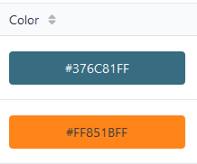
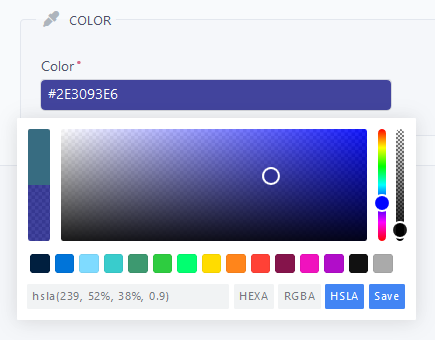

# Additional Templates

`EasyAdminPlus` is packaged with some additional templates for the actions `List` and `Show`.

## [VichUploaderbundle](https://github.com/dustin10/VichUploaderBundle)

The native `EasyAdminBundle` types `image` and `file` only accept a `base_path` property that concats the plain value stored in database with the base_path (also a plain path).

```yaml
- { property: 'image', label: 'Picture', type: 'image', base_path: "%image_path%" }
- { property: 'pdf', label: 'PDF File', type: 'file', base_path: "%file_path%" }
```

It doesn't use the proper helper provided by `VichUploaderBundle`:

```yaml
vich_uploader_asset(object, 'propertyFile')
```
  
It means that if you are using some custom configurations, such as [FileNamer](https://github.com/dustin10/VichUploaderBundle/blob/master/Resources/doc/file_namer/howto/create_a_custom_file_namer.md) or [DirectoryNamer](https://github.com/dustin10/VichUploaderBundle/blob/master/Resources/doc/directory_namer/howto/create_a_custom_directory_namer.md), it'll failed to load the correct url of the resource.

`EasyAdminPlus` is packaged with two new templates that use properly `Vich` helper.

### Template for image

Let's imagine you have an `Entity` with a `@Vich\UploadableField` image:
```php
/**
 * @var string
 *
 * @ORM\Column(name="image", type="string", length=255, nullable=false)
 */
private $image;

/**
 * @var File
 *
 * @Vich\UploadableField(mapping="image", fileNameProperty="image")
 * @Assert\Expression("this.getImageFile() or this.getImage()", message="You must upload a picture.")
 * @Assert\Image()
 */
private $imageFile;
```

Just call our template `@WandiEasyAdminPlus/templates/vich_uploader_image.html.twig` by specifying the related fileNameProperty on the `propertyFile` property:

```yaml
- { property: image, label: 'Picture', template: '@WandiEasyAdminPlus/templates/vich_uploader_image.html.twig', propertyFile: 'logoFile' }
```

Note: this is only required on the `List` or `Show` action, for `New`, `Edit` or `Form` actions, the type `vich_image` is working well.

### Template for file

Let's imagine you have an `Entity` with a `@Vich\UploadableField` file:
```php
/**
 * @var string
 *
 * @ORM\Column(name="pdf", type="string", length=255, nullable=true)
 */
private $pdf;
    
/**
 * @var File
 *
 * @Vich\UploadableField(mapping="file", fileNameProperty="pdf")
 */
private $pdfFile;
    
```

Just call our template `@WandiEasyAdminPlus/templates/vich_uploader_file.html.twig` by specifying the related fileNameProperty on the `propertyFile` property:

```yaml
- { property: pdf, label: 'PDF File', template: '@WandiEasyAdminPlus/templates/vich_uploader_file.html.twig', propertyFile: 'pdfFile' }
```

Note: this is only required on the `List` or `Show` action, for `New`, `Edit` or `Form` actions, the type `vich_file` is working well.

-------

## [VichUploaderbundle](https://github.com/dustin10/VichUploaderBundle) + [LiipImagineBundle](https://github.com/liip/LiipImagineBundle)

If you're also using `LiipImagineBundle` to produce thumbs and you don't want to load huge original pictures in the `List` or `Show` actions, you can also define a custom property to load a specific `Liip` filter.

Let's imagine you have defined a filter for your image:

```yaml
liip_imagine:
    driver: "gd"

    resolvers:
        # ...

    filter_sets:

        image_small:
            jpeg_quality: 60
            filters:
                relative_resize:
                    widen: 100
```

Just call the previous template by also specifying the correct `liipFilter` property:

```yaml
- { property: image, label: 'Picture', template: '@WandiEasyAdminPlus/templates/vich_uploader_image.html.twig', propertyFile: 'logoFile', liipFilter: 'image_small' }
```

Note: the `Liip` filter will be only used to display the base image, the real image source is preserved if you click on the image to zoom (which opens a popin).

-------

## [Enums](https://github.com/greg0ire/enum)

If you're using the great greg0ire's bundle and you want to display real constant values in the `List` and `Show` actions, please follow this guide.

Let's imagine you have an `Entity` with `EnumAssert` that check several constants defined below:

```php
/**
 * @var string
 * @ORM\Column(type="string", length=64, nullable=true)
 * @Assert\Length(max=64)
 * @EnumAssert(class="App\Enum\CompanyOwnerType")
 */
private $ownerType;
```

Your enum type with all the associated constants:

```php
# src/Enum/CompanyOwnerType.php

namespace App\Enum;

use Greg0ire\Enum\AbstractEnum;

final class CompanyOwnerType extends AbstractEnum
{
    const PUBLIC = 'public';
    const PRIVATE = 'private';
}
```

And the dictionnary associated:

```yaml
# translations/enum.en.yaml
app_enum_company_owner_type_public: 'Public'
app_enum_company_owner_type_private: 'Private'
```

Just call our template `@WandiEasyAdminPlus/templates/enum.html.twig` by specifying the related EnumType on the `class` property and the related domain on the `domain` property:

```yaml
- { property: ownerType, label: 'Owner Type', template: '@WandiEasyAdminPlus/templates/enum.html.twig', class: 'App\Enum\CompanyOwnerType', domain: 'enum' }
```

Note: this is only required on the `List` or `Show` action, for `New`, `Edit` or `Form` actions, you can directly use his `FormType` with his FQN.

```yaml
- { property: ownerType, label: 'Owner Type', type: 'Greg0ire\Enum\Bridge\Symfony\Form\Type\EnumType', type_options: { class: 'App\Enum\CompanyOwnerType', prefix_label_with_class: true, translation_domain: 'enum' } }
```

-------

## [WandiColorPicker](https://github.com/WandiParis/ColorPickerBundle)

If you use our ColorPicker bundle and you want to visually display the color, just call our template `@WandiEasyAdminPlus/templates/wandi_color_picker.html.twig`.

```yaml
- { property: color, label: 'Color', template: '@WandiEasyAdminPlus/templates/wandi_color_picker.html.twig' }
```

<p align="center">
    
</p>

Note: this is only required on the `List` or `Show` action, for `New`, `Edit` or `Form` actions, you can directly use his `FormType` with his FQN.

```yaml
- { property: color, label: 'Color', type: 'Wandi\ColorPickerBundle\Form\Type\ColorPickerType' }
```

<p align="center">
    
</p>

[Back to main readme](../README.md)