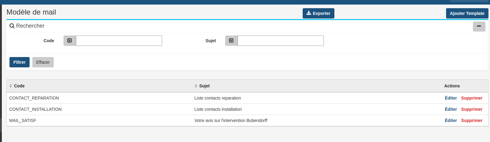

# Filter Action

`EasyAdminPlus` is packaged with a filter module

### Settings

The `filter` is disabled by default.

To enable it, you've to add a new action node (`filter`) in `EasyAdmin` configuration like others ones (`list`, `show`, `new`, `edit`, `form`, `delete`, `search`).

Here's a list of all filters:<br/>
    - AbstractORMFilterType<br/>
    - AutocompleteFilterType<br/>
    - BooleanFilterType<br/>
    - ChoiceFilterType<br/>
    - DateFilterType<br/>
    - DateTimeFilterType<br/>
    - EntityFilterType<br/>
    - EnumerationFilterType<br/>
    - ExactStringFilterType<br/>
    - ManyFilterType<br/>
    - NotNullFilterType<br/>
    - NumberFilterType<br/>
    - NumberRangeFilterType<br/>
    - PeriodeFilterType<br/>
    - StringFilterType<br/>
    - TreeFilterType<br/>
    - UrlAutoCompleteFilterType<br/>
    - WorkflowFilterType<br/>

You've to add this action on all Entities on which you want to enable `filter` feature.

```yaml
# config/packages/easy_admin.yaml
easy_admin:
    entities:
        Demande:
            class: App\Entity\Demande

            filter:
                fields:
                    - { label: 'Source',  filter_type: 'StringFilterType', property: 'source' }
                    - { label: 'Type',  filter_type: 'ChoiceFilterType', property: 'type', config: {choices: ['DI', 'CONTACT', 'INSTALLATION']} }
                    - { label: 'Date',  filter_type: 'DateFilterType', property: 'date' }
                    - { label: 'Statut',  filter_type: 'StringFilterType', property: 'status' }
                    - { label: 'Code Client',  filter_type: 'StringFilterType', property: 'codeClient' }

```


A new panel is visible on top of `List` action with all the filters widget.

  <p align="center">
      
  </p>
 
The filters params are stored in session and can be reset by the Cancel button. When you return on the list the filter is reminded

-------

[Back to main readme](../README.md)
