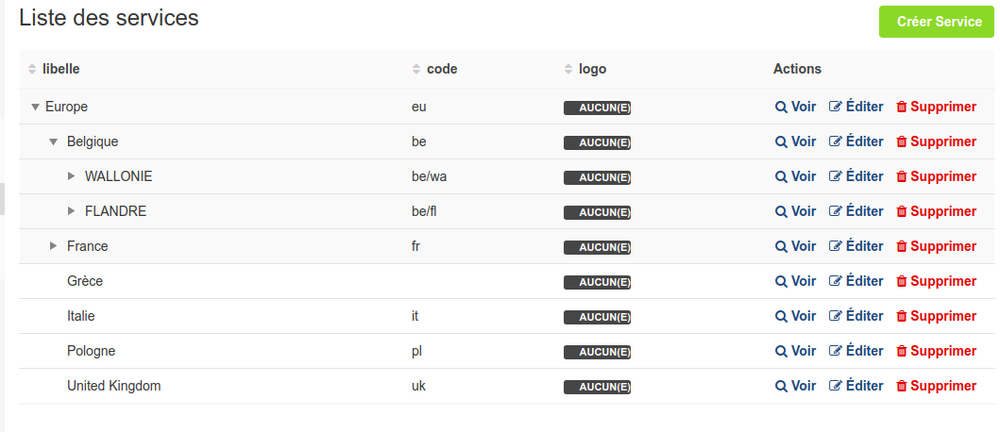

# Tree table for nested set

`EasyAdminPlus` provides a nested set viewer.

<p align="center">
    
</p>

-------
##How to activate

This type allows you to make an autocomplete field like the easyadmin's one, but with customizable URL meaning that you can get autocomplete data from other websites/APIs with AJAX calls. This uses the JQuery's select2.

-------
### How to use it

Configure the nested set entity with tree: true :
```yaml
easy_admin:
    entities:
        Service:
            class: App\Entity\Service
            tree: true
            disabled_actions: []
            list:
```

-------
### Dependency

EasyAdminPlus tree mode need only 3 field. lft, rgt and id.
We don't need to be a gedmo nestedset Entity. But it is of course possible.

Thanks to http://ludo.cubicphuse.nl/jquery-treetable for the javascript part.

This plugin include the treetable, you don't need to include it.

-------
[Back to main readme](../README.md)
