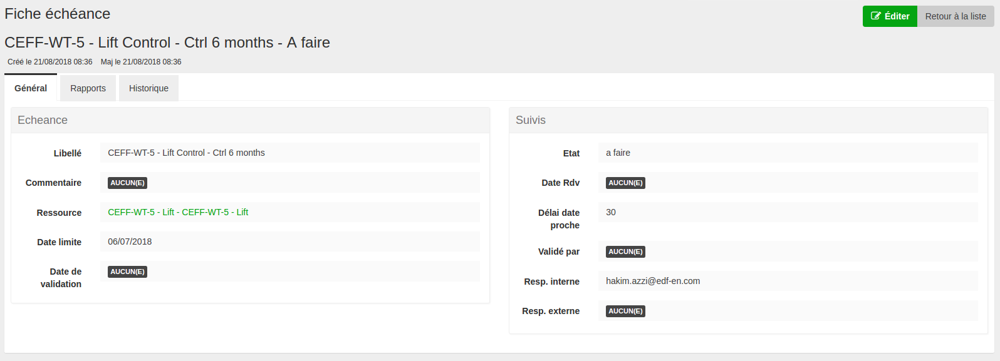

# advanced show view for easyadmin plus

`EasyAdminPlus` provides a way to have tabs and to group fields in the show view.

Sublist is also possible.

<p align="center">
    
</p>

-------
### How to use it

Configure the show entity like this
```yaml
    show:
        title: 'title.echeance.show'
        header_template : 'easy_admin/Controle/_show_header.html.twig'
        actions:
            - { name: edit, icon: edit }
            - { name: delete, icon: trash }
        fields:
            - { type: 'group', css_class: 'col-sm-6', label: 'Echeance' }
            - { property: libelle, label: label.libelle }
            - { property: commentaire, label: label.commentaire, type: raw }
            - { property: ressource, label: label.ressource }
            - { property: dateLimite, label: label.dateLimite }
            - { property: dateOk, label: label.dateOk }
            - { type: 'group', css_class: 'col-sm-6', label: 'Suivis' }
            - { property: etat, label: label.etat }
            - { property: dateRdv, label: label.dateRdv }
            - { property: delaiDateProche, label: label.delaiDateProche }
            - { property: validerPar, label: label.validerPar }
            - { property: responsableInterne, label: label.responsableInterne }
            - { property: responsableExterne, label: label.responsableExterne }

            - { type: 'sublist', id: 'echeances', label: 'tab.echeances', entity: 'Controle', property: 'Controles'}
            - { type: 'sublist', id: 'options', label: 'tab.options', entity: 'Ressource', property: 'Options'}
            - { type: 'sublist', id: 'paniers', label: 'tab.panier', property: 'paniers', entity: 'Panier',template_form: 'easy_admin/Helper/_sub_form.html.twig', add_form: 'App\Form\PanierType',add_route: 'app_admin_eleve_addpanier', with_add: true , 'with_delete': true, add_form_options: {'parent':'{parent}'}}
            - { type: 'tab', id: 'historique', label: 'Historique', action: 'historyAction' }
```

every group open and close a box (bootstrap). If their is a label it show it in the header box.

The tabs must alway be in the last positions.

Action can be a fool custom action like this : 
`App\Controller\CustomController:indexAction`

For the sublist it use the list config from the 'Foreign' Entity declared in the entity Params. Options it the property to get le associated list.

The show display also the "blame and timestamp" info on the record ( under the title ) if the property exist. So just add the BlamableTrait  and Timestampable Trait to make it work

```
use Gedmo\Mapping\Annotation as Gedmo;
use Gedmo\Blameable\Traits\BlameableEntity;
use Gedmo\Timestampable\Traits\TimestampableEntity;

/**
 * Ressource
 * 
 * @Gedmo\Loggable
 * @ORM\Table(name="ressource")
 * @ORM\Entity(repositoryClass="App\Repository\RessourceRepository")
 */
class Ressource
{
    use BlameableEntity;
    use TimestampableEntity;
```

header_template is used to add specific header under the title. Define the path of the twig template to include.

-------
### Dependency

EasyAdminPlus history tab need that the loggable exist and is activated ( the repo should exist )

-------
[Back to main readme](../README.md)
