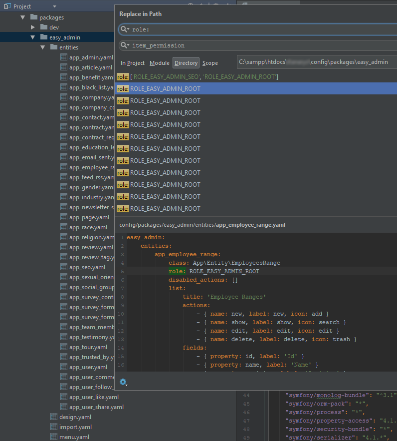
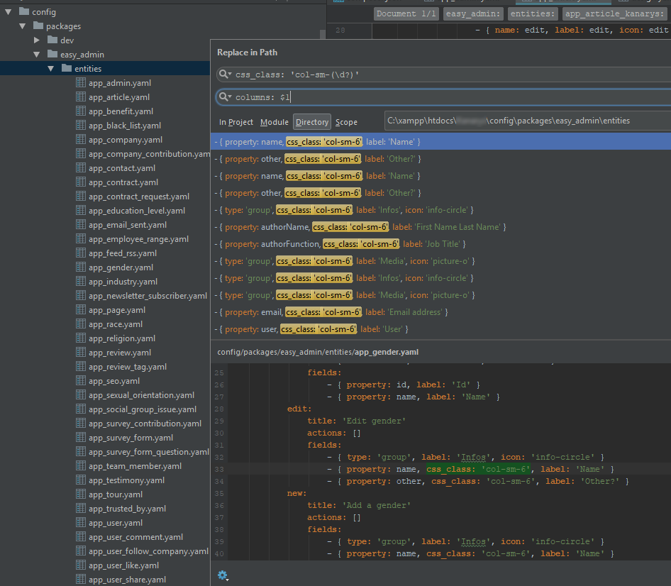

# Migration from 1.x to 2.x

If you've installed `EasyAdminPlus` v1.x and you want to upgrade to 2.x, follow this quick guide.

## Bundle Upgrade

```js
// composer.json
{    
    "require": {
        // ...
        "wandi/easyadmin-plus-bundle": "^2.0",
        // ...
    }
}
```

```shell
> composer update wandi/easyadmin-plus-bundle
```

## EasyAdmin Configuration Update - ACL

### Before

`EasyAdminPlusBundle` 1.x implementeded `entity/action role permissions` thanks to the `role` attribute.

```yaml
# config/packages/entities/{entity}.yaml
easy_admin:
    entities:
        Product:
            class: App\Entity\Product
            list:
                role: ['ROLE_EASY_ADMIN_SUPER']
                # ...
```

### After

Sadly `EasyAdminBundle` introduced this feature with to the `item_permission` attribute.

```yaml
# config/packages/entities/{entity}.yaml
easy_admin:
    entities:
        Product:
            class: App\Entity\Product
            list:
                item_permission: ['ROLE_EASY_ADMIN_SUPER']
                # ...
```
**Search in all your `EasyAdmin` configuration files (`config/packages/easy_admin` directory) for `role:` occurrences and just replace them by `item_permission`**

<p align="center">
    
</p>

## EasyAdmin Configuration Update - Boostrap

`EasyAdminBundle` 2.x upgraded `Bootstrap` to version 4 and deleted the vertical `form_theme`.

### Before

```yaml
# config/packages/entities/{entity}.yaml
easy_admin:
    entities:
        Article:
            class: App\Entity\Article
            list:
                fields: 
                    - { type: 'group', columns: 6, label: 'Infos', icon: 'info-circle' }
                    - { property: title, columns: 6, label: 'Title' }
                    - { property: slug, columns: 6, label: 'Slug' }
                    - { type: 'group', label: 'NB', icon: 'bar-chart' }
                    - { property: nbLikes, columns: 4, label: 'NB Likes', type_options: { disabled: true } }
                    - { property: nbComments, columns: 4, label: 'NB Comments', type_options: { disabled: true } }
                    - { property: nbShares, columns: 4, label: 'NB Shares', type_options: { disabled: true } }
                    # ...
```

### After

```yaml
# config/packages/entities/{entity}.yaml
easy_admin:
    entities:
        Article:
            class: App\Entity\Article
            list:
                fields: 
                    - { type: 'group', columns: 6, label: 'Infos', icon: 'info-circle' }
                    - { property: title, columns: 6, label: 'Title' }
                    - { property: slug, columns: 6, label: 'Slug' }
                    - { type: 'group', label: 'NB', icon: 'bar-chart' }
                    - { property: nbLikes, columns: 4, label: 'NB Likes', type_options: { disabled: true } }
                    - { property: nbComments, columns: 4, label: 'NB Comments', type_options: { disabled: true } }
                    - { property: nbShares, columns: 4, label: 'NB Shares', type_options: { disabled: true } }
                    # ...
```

**Search in all your `EasyAdmin` configuration files (`config/packages/easy_admin` directory) for `css_class: 'col-sm-(\d?)'` occurrences and just replace them by `columns: $1`**

<p align="center">
    
</p>

** If you used the vertical `form_theme`, think to remove it **

```yaml
# config/packages/easy_admin/design.yaml
easy_admin:
    # ...
    design:
        form_theme:
            - 'vertical'
    # ...
```

